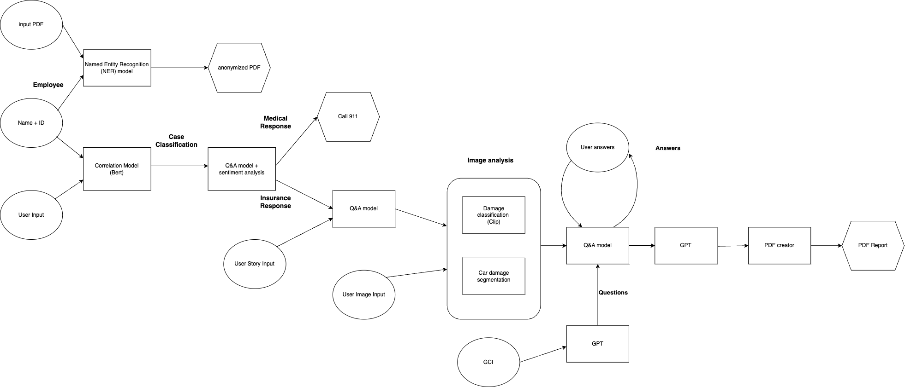

# Hack Zurich 2023 - Insurance Assistant Chatbot


## Overview

Welcome to our project for Hack Zurich 2023! Our aim is to make a significant positive impact on people's lives, particularly in their moments of crisis. This repository contains our innovative insurance assistant designed to provide real-time, comprehensive assistance through a chat interface.



## Table of Contents

- [Inspiration](#inspiration)
- [Features](#features)
- [How It Works](#how-it-works)
- [Getting Started](#getting-started)
- [Team](#team)

## Inspiration

Our inspiration is rooted in the desire to make a meaningful difference in people's lives during their most challenging moments. We understand that high-quality insurance service is critical in times of unexpected events. Learn more [here](#inspiration).

## Features


<div float="left">
  <figure>
    
    <figcaption>Image of a car after accident</figcaption>
  </figure>
  <figure>
    
    <figcaption>degmented damege</figcaption>
  </figure>
</div>

- **Real-time Chat Support**
- **Emergency Assessment & Coordination**
- **Professional Report Generation**
- **Policy Analysis**
- **Multi-modal Interaction (Text and Voice)**
- **Accident Image Analysis**
- **Data Anonymization for Privacy**

## How It Works

1. **Web Interface**: A web interface for client interaction.
2. **Case Classification**: Uses correlation models for classifying the type of case.
3. **Image Analysis**: Utilizes segmentation models and multi-modal encoders.
4. **Q&A and Sentiment Analysis**: Fills out relevant details.
5. **Report Generation**: Creates a professional report for the insurance company and provides suggestions to the client.
6. **Voice Conversation**: Uses Text-to-Speech and Speech-to-Text models.

## Getting Started

To get a local copy up and running, follow these steps:

1. Clone the repo

   ```sh
   git clone https://github.com/YourUsername/YourRepoName.git

   ```

2. Install required packages
   ```sh
   pip install -r requirements.txt
   ```
3. Run the main script
   ```sh
   python main.py
   ```

## Team

- Nadav Rubinstein
- Gil Litvin
- Edo Cohen

For more information or queries, feel free to contact us.

---

Made with :heart: at Hack Zurich 2023!
